# Sonic Staking

This repository includes all contracts used for the LST Staked S ($stkS) by Beets.

## SFC

Staking on Sonic is done via the Special Fees Contract (SFC) as per this [repo](https://github.com/Fantom-foundation/opera-sfc). Our LST implements against [this commit](https://github.com/Fantom-foundation/opera-sfc/tree/8c700e0ef1224cdb29e8afed6ea89eacdfba9dd7).

Below describes functions used by the LST contract for general understanding.

### Epochs

The SFC defines so-called epochs. Epochs are sealed by the node driver. After an epoch is sealed, total rewards earned in that epoch are calculated. This is used to calculate the rewards received by validators and delegators.

### delegate

The staking system on Sonic, which is handled in the SFC, uses Validators and delegators. Validators run validator nodes that secure the network. To run a validator, a validator needs to have at least 50k $S self-staked. The validator can then have 15 times this amount delegated to it. To delegate to a validator, once calls [delegate()](https://github.com/Fantom-foundation/opera-sfc/blob/8c700e0ef1224cdb29e8afed6ea89eacdfba9dd7/contracts/sfc/SFC.sol#L392) on the SFC and passes the amount of $S as a value because it is a payable function.

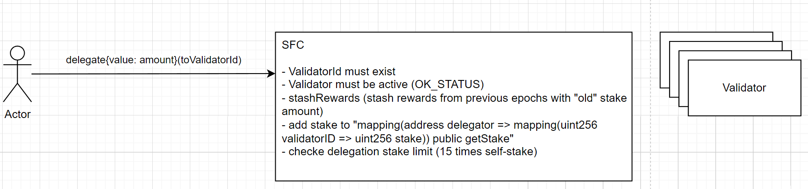

### undelegate and withdraw

There is _no_ locking but an unbonding period of two weeks. Getting the delegated funds back is a two step process with a two week waiting period in between. You first call [undelegate](https://github.com/Fantom-foundation/opera-sfc/blob/8c700e0ef1224cdb29e8afed6ea89eacdfba9dd7/contracts/sfc/SFC.sol#L466) and after two weeks you can withdraw your $S via [withdraw](https://github.com/Fantom-foundation/opera-sfc/blob/8c700e0ef1224cdb29e8afed6ea89eacdfba9dd7/contracts/sfc/SFC.sol#L398).

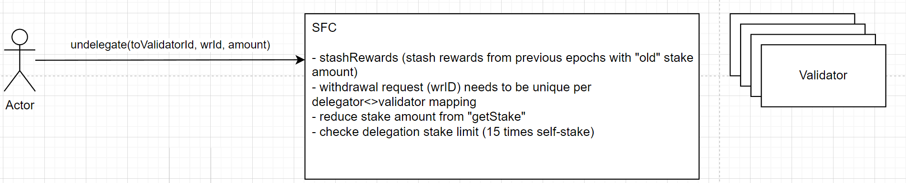
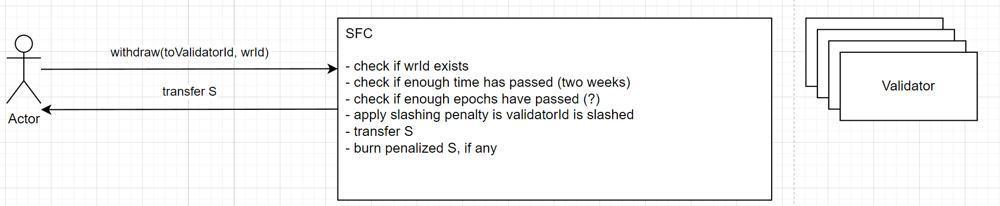

### claim rewards and pending rewards

All rewards are hadled via stashes in SFC. This means that everytime an epoch seals, [rewards are stashed for that particular epoch](https://github.com/Fantom-foundation/opera-sfc/blob/8c700e0ef1224cdb29e8afed6ea89eacdfba9dd7/contracts/sfc/SFC.sol#L308). This is then used to calculate how much rewards a delegator receives for this epoch.

Delegated $S is entitled to staking rewards which can be claimed via [claimRewards()](https://github.com/Fantom-foundation/opera-sfc/blob/8c700e0ef1224cdb29e8afed6ea89eacdfba9dd7/contracts/sfc/SFC.sol#L448)

Pending rewards can be queried via [pendingRewards()](https://github.com/Fantom-foundation/opera-sfc/blob/8c700e0ef1224cdb29e8afed6ea89eacdfba9dd7/contracts/sfc/SFC.sol#L448)

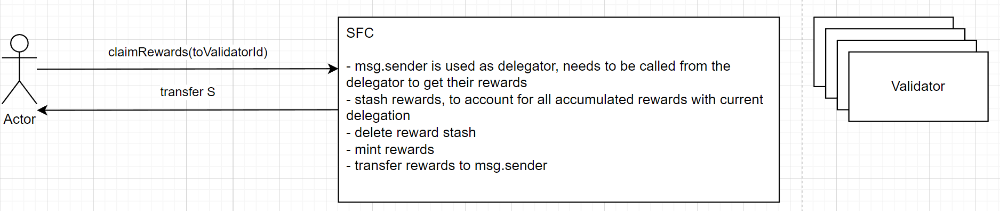

## Sonic Staking

This contract handles all operations for the LST $stkS. In general, a user deposits $S into the contract and receives $stkS in returned, based on the current rate.

### deposit (user function)

A user deposits $S into the Sonic Staking contract and receives $stkS based on the current rate. The $S that has been sent to the contract is first added to the so-called pool and will not be delegated straight away.
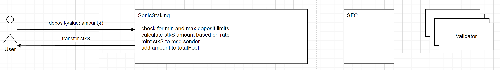

### undelegate (user function)

If a user wants to redeem $stkS for $S, this is done via two-step withdrawal process via the Sonic Staking contract. A user calls `undelegate()` on the Sonic Staking contract. First, the Sonic Staking contract will withdraw as much as possible from the pool. Any left over amount that needs to be withdrawn is undelegated from the provided validators. The $stkS will be burned in the process.
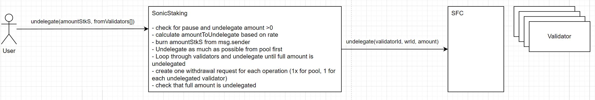

### withdraw (user function)

After the two week unbonding period, the user can withdraw the $S by calling `withdraw()`. This will mark the withdrawals as withdrawn and send the $S to the user.
If a validator acts maliciously it can be slashed by the SFC, effectively reducing its stake. This means that any delegated $S will also be reduced, effectively reducing the amount of $S a user receives when withdrawing. To allow for "force" withdrawals, the flag `emergency` is set to true.
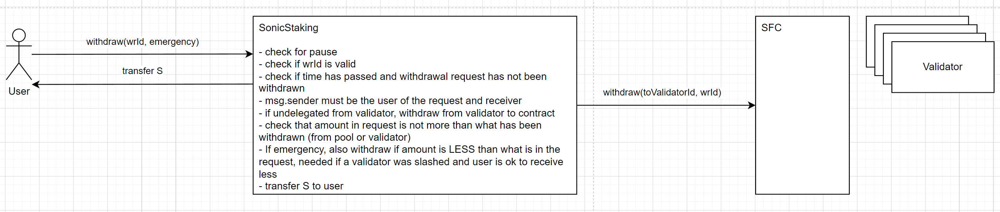

### delegate (operator function)

$S that has been deposited into the pool will be delegated to defined validators by calling `delegate()` from the operator role. This $S is then reduced from the pool amount, added to the total delegate amount and delegated to the specified validator and will start to earn rewards.
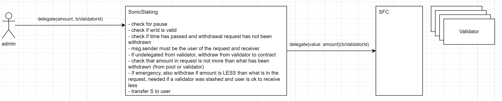

### claimRewards (operator function)

To claim rewards and actually increase the rate of $stkS against $S, `claimRewards()` needs to be called by the operator. This will claim rewards from the specified validators, deduct the protocol fee and add the remaining funds to the pool, effectively increasing the amount of $S in the system while $stkS supply stays the same.
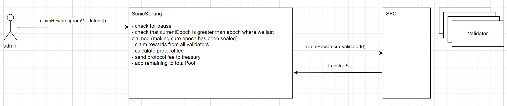

### undelegateToPool (operator function)

If a validator has an issue, i.e. is not online anymore, it doesnt produce rewards for the delegated stake. In that case, it is important that the delegated amount can be withdrawn to the pool and delegated to another validator. This function initiats an undelegation without burning $stkS, as the withdrawn $S will in the end go back t the pool, this should not affect the rate.
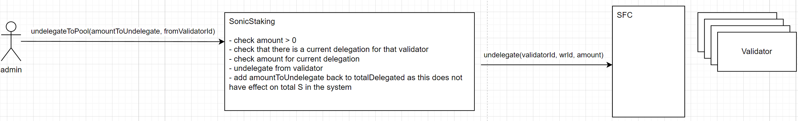

### withdrawToPool (operator function)

Once unboding time is ower, the undelegated $S can be withdrawn into the pool.
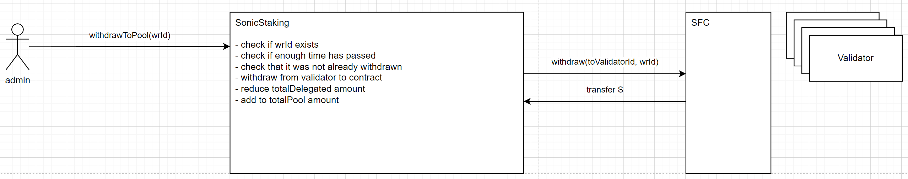

## Dev notes

Need node version >18, otherwise solidity-ast error

run tests with `forge clean && forge test -vvv`

deploy to fork
`forge script DeploySonicStaking --fork-url https://rpc.fantom.network --fork-block-number 97094615 --force 0xFC00FACE00000000000000000000000000000000 0xa1E849B1d6c2Fd31c63EEf7822e9E0632411ada7 0xa1E849B1d6c2Fd31c63EEf7822e9E0632411ada7 --sig 'run(address,address,address)'`

## Todo

1. Add timelock for admin and test
2. Test upgrade of contract
3. Think about dealing with slashed validators on an operator level, i.e. could operator withdraw and add funds at the same time to keep rate. Or could operator withdraw and let the rate decrease.
